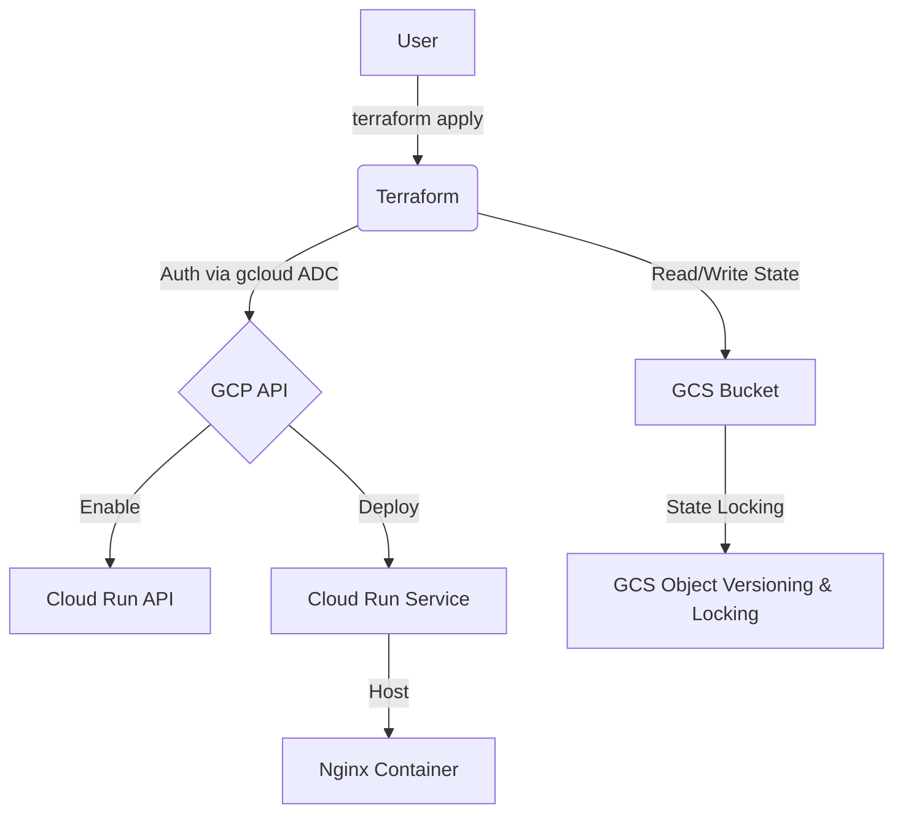
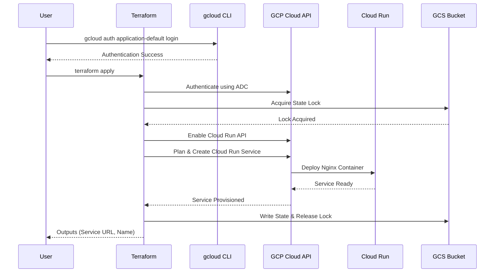
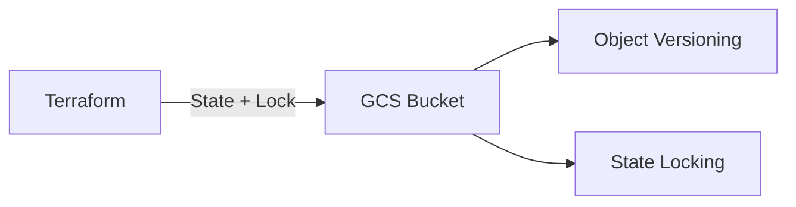
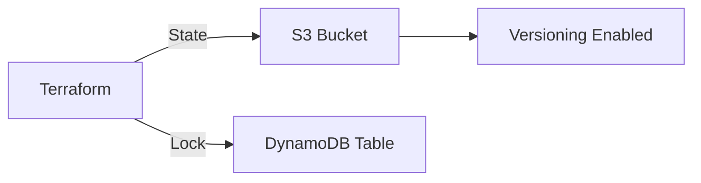
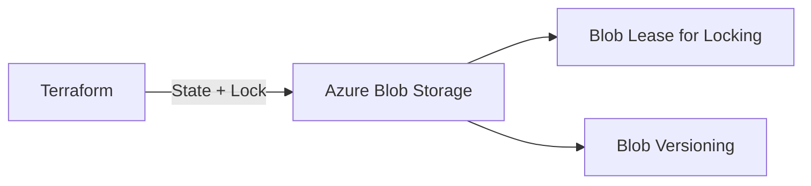
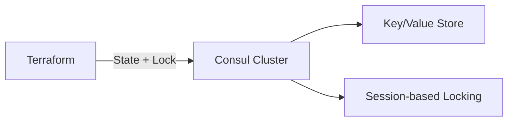
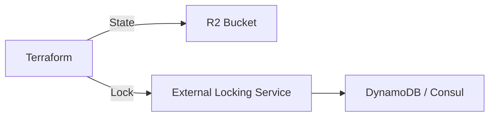

# terraform-remote-state-locking

This Terraform project demonstrates how to use remote state locking with various backend options, while deploying a Google Cloud Run service running a default Nginx container.

## Remote State Locking

Remote state locking is a critical feature that prevents concurrent operations on the same Terraform state, which can cause corruption or unexpected behavior. When using a remote backend, Terraform automatically acquires a lock before making changes and releases it afterward.

## Architecture

### Current Implementation (GCS Backend)
This project currently uses Google Cloud Storage (GCS) as the remote backend with state locking enabled.



### Sequence Diagram


## Backend Options

Terraform supports multiple remote backends with state locking. Below are popular options:

### 1. Google Cloud Storage (GCS) - Current Implementation


**Features:**
- Built-in state locking
- Object versioning for state history
- IAM permissions for access control
- Regional/multi-regional availability

### 2. AWS S3 + DynamoDB


**Features:**
- S3 for state storage
- DynamoDB for state locking
- IAM policies for security
- Versioning and encryption support

### 3. Azure Blob Storage


**Features:**
- Blob storage for state
- Blob leases for locking
- Azure RBAC for access control
- Soft delete and versioning

### 4. HashiCorp Consul


**Features:**
- Distributed KV store
- Session-based locking
- Service discovery integration
- Self-hosted or HCP Consul

### 5. Cloudflare R2


**Features:**
- S3-compatible object storage
- No egress fees
- Global edge network
- Note: Requires separate locking mechanism

## Connectivity

- **Inbound Access**: Publicly accessible from the internet via the generated Service URL.
- **Outbound Access**: The container has full access to the public internet (e.g., for API calls, updates, or external dependencies).
- **Ingress Settings**: Configured to `INGRESS_TRAFFIC_ALL` to allow all external requests.

## Service Specifications (Free Tier Optimized)

- **Container Image**: `nginx:latest` (Default).
- **Location**: Restricted to `us-west1`, `us-central1`, or `us-east1` (GCP Always Free Tier regions).
- **Scaling**: `max_instance_count` set to `1` to prevent unexpected horizontal scaling costs.
- **Resources**:
  - **CPU**: 1 vCPU (CPU only allocated during request processing to maximize free tier seconds).
  - **Memory**: 256 MiB.
- **Ingress**: `All` (Publicly accessible).
- **Authentication**: Unauthenticated access enabled.
- **Naming**: A random 8-character hex suffix is automatically appended to your `service_name` to ensure project-wide uniqueness.

## GCP Free Tier Limits (Always Free)

To stay within the free tier, ensure your usage does not exceed:

- **Requests**: 2 million requests per month.
- **Compute**: 360,000 vCPU-seconds and 180,000 GiB-seconds of memory per month.
- **Data Transfer**: 1 GB of outbound data transfer per month (within North America).

## Prerequisites

1. **Google Cloud SDK**: `https://cloud.google.com/sdk/docs/install` .
2. **Terraform**: `https://developer.hashicorp.com/terraform/downloads` .

## Setup & Deployment

1. **Authenticate and Select Project**:
   Instead of using a service account JSON file, this project uses your local `gcloud` credentials.

   ```bash
   # Authenticate
   gcloud auth application-default login

   # Select your project
   gcloud config set project your-project-id
   ```

2. **Configure Variables**:
   Create a `terraform.tfvars` file based on the example:

   ```hcl
   project_id   = "your-project-id"
   region       = "us-central1"
   ```

3. **Initialize Backend (One-time)**:
   Ensure your GCS bucket exists and is configured for versioning and locking.

   ```bash
   terraform init
   ```

4. **Deploy**:

   ```bash
   # Apply changes
   terraform apply
   ```

5. **Outputs**:
   After a successful deployment, Terraform will output the Cloud Run service URL and name.
